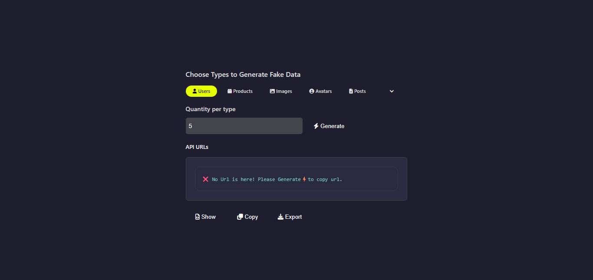
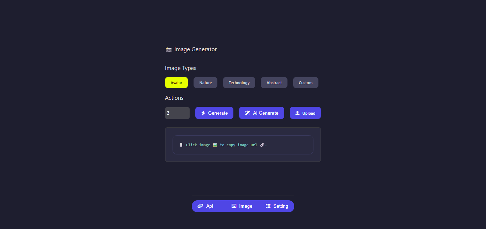
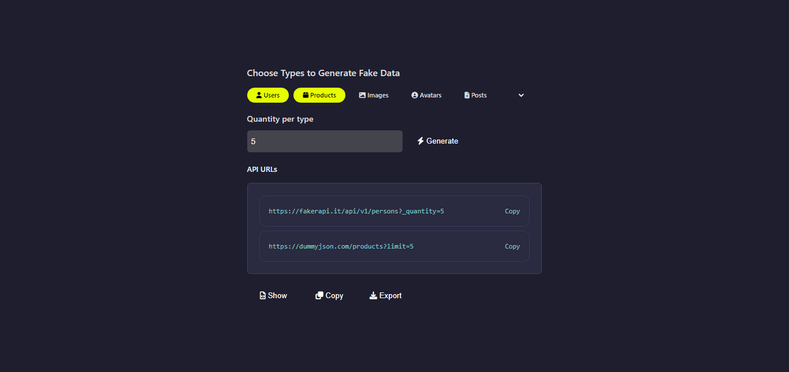
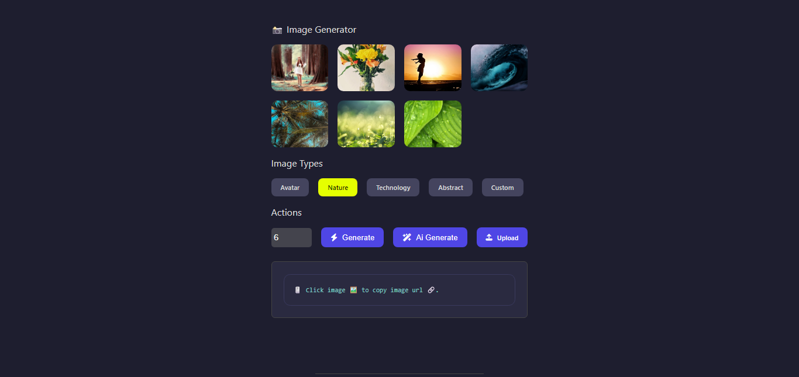
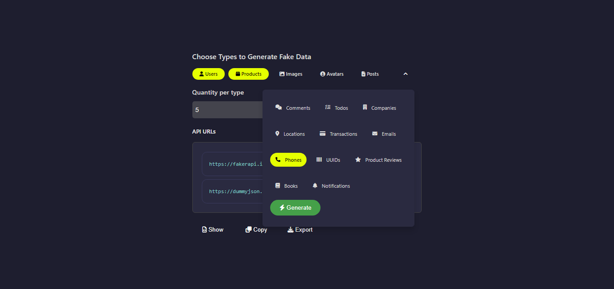
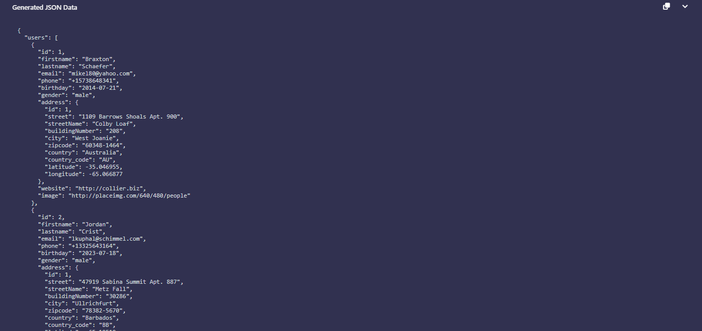
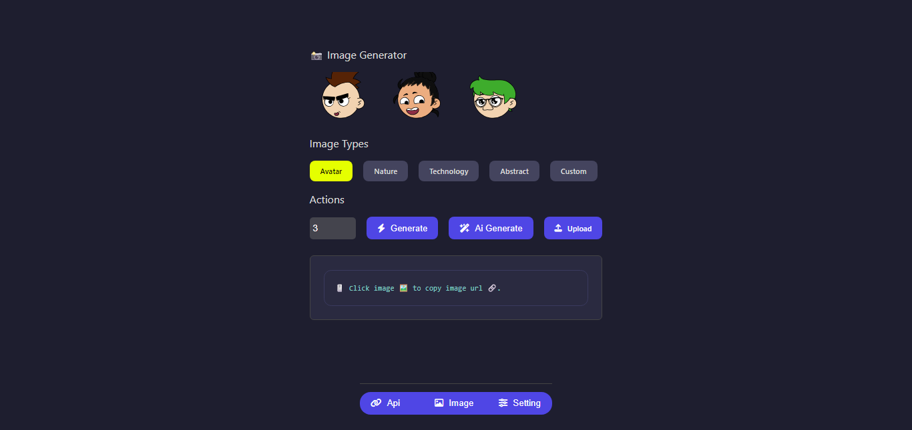
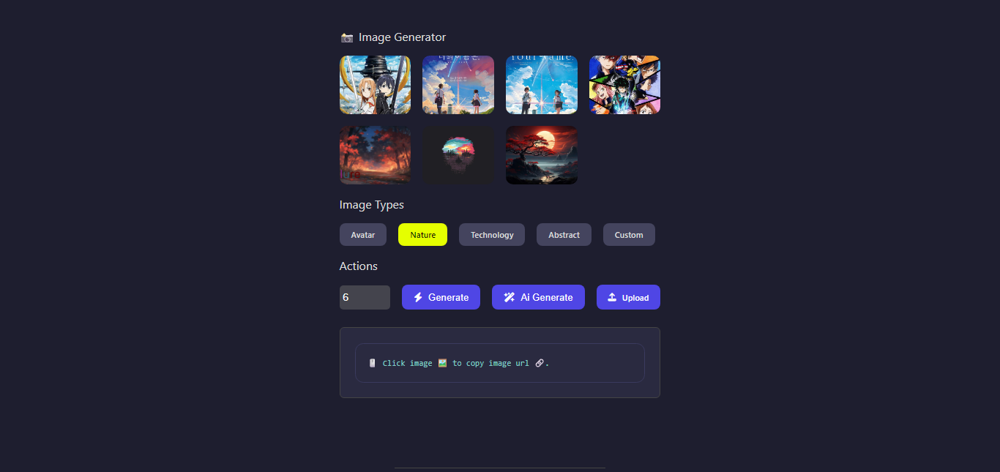

# Fakley Chrome Extension

**Version:** 2.0  
**Description:** Fakley is a powerful developer tool that allows you to generate live dummy API URLs, export JSON data, and deploy to mock services in seconds.


## 🚀 Features

### New UI Look with Nav-Bar

- 🔧 Generate dynamic dummy API endpoints instantly
- 🧾 Export generated JSON data
- 🌐 Deploy data to public mock APIs
- 📋 Copy data to clipboard
- 🗃️ Persistent storage using browser storage API
- 🖼️ Simple and intuitive popup interface

## new - added

- 🪄 AI Image Generated
- 🔗 Api Image Generated
- 🔵 Select image type
- 🔵 Click to on image copy image url path

## 📁 Project Structure

```
fakley/
├── icons/               # Extension icons
│   └── icon.png
├── screenShort/         # Screenshots for documentation
│   ├── api_url.png
│   ├── Fakley-1.png
│   ├── home.png
│   ├── json_codes.png
│   └── more-data-types.png
├── popup.html           # Main popup UI
├── popup.js             # Extension logic
├── styles.css           # Popup styling
└── manifest.json        # Chrome extension manifest (v3)
```

## 🧪 How to Use

1. **Install in Chrome:**

   - Download or clone this repository.
   - Open Chrome and go to `chrome://extensions/`.
   - Enable **Developer Mode** (top right).
   - Click **Load unpacked** and select the `fakley/` directory.

2. **Open the Extension:**

   - Click on the Fakley icon in the browser toolbar.
   - Use the popup to generate and export dummy APIs.

3. **Deploy or Export:**
   - Copy API URLs.
   - Export JSON responses.
   - Integrate with frontend applications for testing.

## 🛠️ Built With

- HTML5
- CSS3
- JavaScript (Vanilla)
- Chrome Extension API (Manifest v3)

## 📷 Screenshots










## 📄 License

This project is licensed under the MIT License.

---

**Developed by [Mohammed Sajjad Hosan](https://facebook.com/MohammadSajjadHosan0)**
